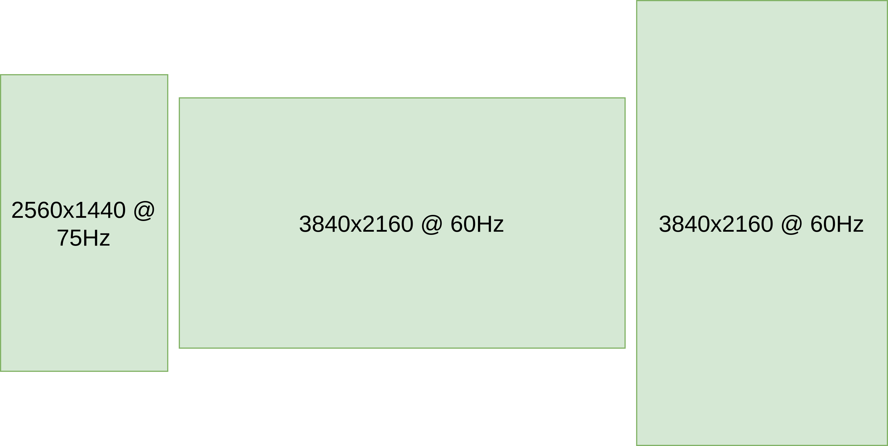

# Dotfiles

我的dotfiles配置

我的bspwm和hyprland相关配置

## 平台简介

系统： Arch linux

Terminal: Alacritty

neovim: [ayamir's neovim dot](https://github.com/ayamir/nvimdots) 

 | -          | x11                                       | wayland  |
 | ---------- | ----------------------------------------- | -------- |
 | TWM        | bspwm                                     | hyprland |
 | 状态栏     | polybar                                   | waybar   |
 | 墙纸工具   | feh                                       | swww     |
 | compositor | [picom](https://github.com/FT-Labs/picom) | hyprland |
 | 锁屏工具   | i3lock-color-git                          | hyprlock |
 | 启动器     | rofi                                      | wofi     |

## 效果

### wayland

## 动机

三个显示器

三个显示器位置，工作区，墙纸等如何优雅设置，成为了我折腾的主要动力

### X11
[xrandr.sh](./x11/bspwm/scripts/xrandr.sh)脚本设置显示器位置

[bspwmrc](./x11/bspwm/bspwmrc)设置工作区

[wallpaper.sh](./x11/bspwm/scripts/wallpaper.sh)使用`feh`设置墙纸

[lock.sh](./x11/bspwm/scripts/lock.sh)使用[i3lock-color-git](https://github.com/Raymo111/i3lock-color)锁屏

选择FT-labs维护[picom](https://github.com/FT-Labs/picom)作为混成器

rofi使用了[@adi1090x](https://github.com/adi1090x/rofi.git)的配置

### wayland

[hyprland.conf](./wayland/hypr/hyprland.conf)设置显示器位置，工作区，自带混成器，动画很丝滑。

[swww.sh](./wayland/hypr/scripts/swww.sh)定时为显示器修改墙纸，横屏竖屏使用不同文件夹，另外swww效果很不错。

锁屏最开始使用`swaylock-effects`,后来发现`hyprlock`是真的好看

暂时写到这里，有时间再更新。
